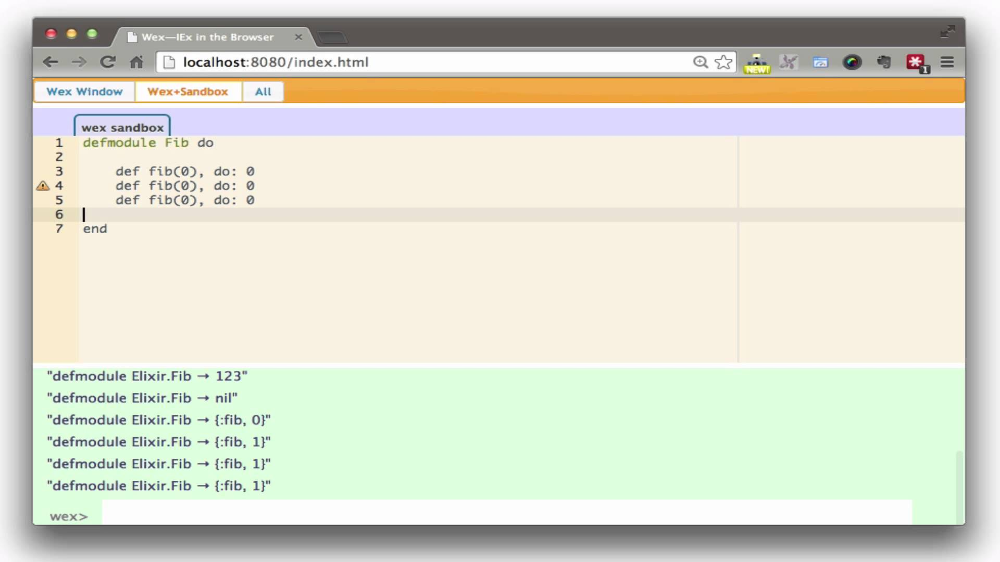

//:backend: slidy2
//:slidefontsizeadjust: 4

== Schema
[gray]#Elixir is NOT Erlang#

    * **Introduction**
    * Syntax and basics
    * Tools
    * Methaprogramming

== Elixir aims
[gray]#Elixir is NOT Erlang > introduction#

[cols=2, frame="none", grid="none", align="center"]
|==================
a|

a|
Designed for concurrency, robustness, [blue]#productivity, extensibility, compatibility#
|==================

== How it was born
[gray]#Elixir is NOT Erlang > introduction#

<<<
[gray]#Elixir is NOT Erlang > introduction#

[cols=2, frame="none", grid="none", align="center"]
|==================
a|

[big red]#FREE LUNCH IS OVER# +
[green]#2005# article

a|
:incremental!:

A programer after listening it...

|==================

<<<
[gray]#Elixir is NOT Erlang > introduction#

[cols=2, frame="none", grid="none", align="center"]
|==================
a|

[big red]#FREE LUNCH IS OVER# +
[green]#2005# article

a|
:incremental!:

[green big]#2009# [big]#Rails is Thread safe!#

|==================

<<<
[gray]#Elixir is NOT Erlang > introduction#

[cols=2, frame="none", grid="none", align="center"]
|==================
a|

[big red]#FREE LUNCH IS OVER# +
[green]#2005# article

a|
:incremental!:

[big green]#2009...# [big]#Rails is Thread safe?#

2009 fixing bugs +
2010 fixing bugs +
...  fixing bugs

hacker fixing and thinking...
|==================

<<<
[gray]#Elixir is NOT Erlang > introduction#

[cols=2, frame="none", grid="none", align="center"]
|==================
a|

a|

|==================

<<<
[gray]#Elixir is NOT Erlang > introduction#

[cols=2, frame="none", grid="none", align="center"]
|==================
a|

a|

|==================

<<<
[gray]#Elixir is NOT Erlang > introduction#

[cols=2, frame="none", grid="none", align="center"]
|==================
a|
image::jose_valim2.jpg[width=300, align="center"]

a|

|==================

== How it was born > the name
[gray]#Elixir is NOT Erlang > introduction#

[cols=2, frame="none", grid="none", align="center"]
|==================
a|
[quote, D. E. Knuth]
The most important thing in the programming language is the name. A language will not succeed without a good name. I have recently invented a very good name and now I am looking for a suitable language. 

a|

image::donald_knuth.jpg[width=200, align="left"]

|==================

http://nimrod-lang.org/

Elixir name...

<<<
[gray]#Elixir is NOT Erlang > introduction#

[cols=2, frame="none", grid="none", align="center"]
|==================
a|
[quote, José Valim]
[...] I dont have a specific reason to choose Elixir name.

a|

|==================

== Small though > JavaVM and new languages
[gray]#Elixir is NOT Erlang > introduction#

    * Scala -> functional programing
    * Groovy -> dynamic programing
    * Clojure -> LISP
    * Groovy/Gradle on Java projects
    * Scala/akka on Java projects
    * ...
    

== Schema
[gray]#Elixir is NOT Erlang#

    * Introduction
    * **Syntax and basics**
    * Tools
    * Methaprogramming

== Hello world
[gray]#Elixir is NOT Erlang > Syntax and basics#

a bit of code...

== Syntax differences > Modules
[gray]#Elixir is NOT Erlang > Syntax and basics#

[cols=2, frame="none", grid="none", align="center"]
|==================
a|
Erlang
[source, erlang]
----------
-module(module_name).

hello() ->
  io:format("~s~n", ["Hello world!"]).
----------

a|
Elixir
[source, ruby]
----------
defmodule FirstModule do
  def hello do
    IO.puts "Hello World"
  end
end
----------

|==================

<<<

[cols=2, frame="none", grid="none", align="center"]
|==================
a|

In Elixir you can have several modules per file.

And also modules inside modules.

a|

[source, ruby]
----------
defmodule FirstModule do
    def hello do
        IO.puts "Hello World"
    end

    defmodule  NestedModule do
        def hello do
            IO.puts "Hello from nested"
        end
    end
end
----------

|==================

== Syntax differences > Variables
[gray]#Elixir is NOT Erlang > Syntax and basics#

[cols=2, frame="none", grid="none", align="center"]
|==================
a|
Erlang
[source, erlang]
----------
> X = 1.
> Y = 2.
> X+Y.

> X = 11.
ERROR!!!
----------

a|
Elixir
[source, ruby]
----------
> x = 1
> y = 2
> x+y

> x = 11
OK!!!

> ^x=11
ERROR!!!
----------

|==================

== Syntax differences > Variable rebound
[gray]#Elixir is NOT Erlang > Syntax and basics#

    * Has INMUTABILITY
    * You can rebound

[source, ruby]
----------
> x = 1
> x = "Hi there"

> ^x = 33
Rebound ERROR!!!
----------

== Syntax differences > Strings
[gray]#Elixir is NOT Erlang > Syntax and basics#

[cols=2, frame="none", grid="none", align="center"]
|==================
a|
Erlang
[source, erlang]
----------
> X = "Hello world"
> Y = <<"Hello world">>
----------

a|
Elixir
[source, ruby]
----------
x = 'Hello world'
y = "Hello world'

multy_line_string = """ this is
a multyline string
with three lines"""
----------

|==================

== Syntax differences > String interpolation
[gray]#Elixir is NOT Erlang > Syntax and basics#

[source, ruby]
----------
> number = 1
> string = "the number is {#number}"
----------

It's valid for any Elixir code

== Syntax differences > Calling functions
[gray]#Elixir is NOT Erlang > Syntax and basics#

Erlang
[source, erlang]
----------
> module:function()
> module:funct_with_params(A, B)
----------

Elixir
[source, ruby]
----------
> Module.function()
> Module.funct_with_params(a, b)
> Module.SubModule.funct_with_params(a, b)
> :erlang_module.function()

> Module.function
> Module.funct_with_params a, b
> Module.SubModule.funct_with_params a, b
> :erlang_module.function
----------

<<<

[IMPORTANT]
Spaces are not allowed between function name and '('

== Syntax differences > Atoms
[gray]#Elixir is NOT Erlang > Syntax and basics#

[cols=2, frame="none", grid="none", align="center"]
|==================
a|

[source, erlang]
----------
> atom.
> Var=1.
----------

a|

[source, ruby]
----------
> :atom
> var=1
----------

|==================

<<<

[NOTE]
Module names are also *atoms* +
MyModule is expanded to the *atom*  Elixir.MyModule

== Syntax differences > Tuples and Lists
[gray]#Elixir is NOT Erlang > Syntax and basics#

[cols=2, frame="none", grid="none", align="center"]
|==================
a|

[source, erlang]
----------
> {1, "Hi"}.
> [1, 2, 3].
----------

a|

[source, ruby]
----------
> {1, "Hi"}
> [1, 2, 3]
----------

|==================

== Syntax differences > Keywordslists
[gray]#Elixir is NOT Erlang > Syntax and basics#

Erlang
[source, erlang]
----------
> [{another_key,20},{key,10}].
----------

Elixir
[source, ruby]
----------
> [{:another_key, 20},{:key, 10}]

> kw = [another_key: 20, key:  10]
> kw[:key]
10
----------

== Syntax differences > Maps
[gray]#Elixir is NOT Erlang > Syntax and basics#

[cols=2, frame="none", grid="none", align="center"]
|==================
a|
Erlang
[source, erlang]
----------
> Map = #{key => 0}
> Updated = Map#{key := 1}
> #{key := Value} = Updated
> Value =:= 1
----------

a|
Elixir
[source, ruby]
----------
map = %{:key => 0}
map = %{map \| :key => 1}
%{:key => value} = map
value === 1
----------

[source, ruby]
----------
map = %{key: 0}
map = %{map \| key: 1}
map.key === 1
----------

|==================

== Syntax differences > Regular Expresions
[gray]#Elixir is NOT Erlang > Syntax and basics#

Erlang
[source, erlang]
----------
{ ok, Pattern } = re:compile("abc\\s").
re:run("abc ", Pattern).
%=> { match, ["abc "] }
----------

Elixir
[source, ruby]
----------
Regex.run ~r/abc\s/, "abc "
#=> ["abc "]
----------

== Syntax differences > Sending and receiving messages
[gray]#Elixir is NOT Erlang > Syntax and basics#

[cols=2, frame="none", grid="none", align="center"]
|==================
a|

[source, erlang]
----------
Pid = self().

Pid ! { hello }.

receive
  { hello } -> ok;
  Other -> Other
after
  10 -> timeout
end.
----------

a|

[source, ruby]
----------
pid = Kernel.self

send pid, { :hello }

receive do
  { :hello } -> :ok
  other -> other
after
  10 -> :timeout
end
----------

|==================

== Defining functions
[gray]#Elixir is NOT Erlang > Syntax and basics#

[source, ruby]
----------
defmodule  DefFunction  do
    
    def  min(a, b) when a<b  do
       true
    end

    def  min(a, b) do
       false
    end

    defp  private(a)  do
        IO.puts "This is a private function #{inspect a}"
    end

end
----------

== Anonymous functions
[gray]#Elixir is NOT Erlang > Syntax and basics#

[source, ruby]
----------
iex(2)> af = fn x -> x*2 end
iex(3)> af.(3)
6
----------

== Anonymous functions Capturing
[gray]#Elixir is NOT Erlang > Syntax and basics#

[source, ruby]
----------
iex(7)> af = &(&1 * &2 + 1)
iex(8)> af.(3, 2)
7
----------

== Default arguments
[gray]#Elixir is NOT Erlang > Syntax and basics#

[source, ruby]
----------
defmodule  Pr  do

  def default_argument(a, b \\ 3) do
      a*b
  end

end

...

iex(18)> Pr.default_argument 5, 6                                                                                                    
30                                                                                                                                   
iex(19)> Pr.default_argument 5                                                                                                       
15                                                                                                                                   
iex(20)>  
----------

== Pipe operator
[gray]#Elixir is NOT Erlang > Syntax and basics#

[cols=2, frame="none", grid="none", align="center"]
|==================
a|

[source, ruby]
----------
Elixir = Functional
         \|> Concurrent
         \|> Pragmatic
         \|> Fun
----------

a|
image::book_pragmatic.jpg[width=300]

|==================

== Streams
[gray]#Elixir is NOT Erlang > Syntax and basics#

This is very expensive...

[source, ruby]
----------
Enum.reduce((for x<-1..100_000_000, do: x), &(&1+&2))
----------

<<<
[gray]#Elixir is NOT Erlang > Syntax and basics#

This is cheaper...

[source, ruby]
----------
iex(21)> Enum.reduce(1..100_000_000, &(&1+&2))                                                                               
----------

<<<
[gray]#Elixir is NOT Erlang > Syntax and basics#

[source, ruby]
----------
iex(21)> 1..100_000_000  |> Enum.reduce(&(&1+&2))                                                                               
----------

<<<
[gray]#Elixir is NOT Erlang > Syntax and basics#

[source, ruby]
----------
iex(20)> Enum.to_list  1..10                                                                                                      
[1, 2, 3, 4, 5, 6, 7, 8, 9, 10] 
----------

    1..10 generates a Stream

[source, ruby]
----------
iex(20)> 1..10  |>  Enum.to_list                                                                                                      
[1, 2, 3, 4, 5, 6, 7, 8, 9, 10] 
----------

== What and How, example in Elixir
[gray]#Elixir is NOT Erlang > Syntax and basics#

<<<
[gray]#Elixir is NOT Erlang > Syntax and basics#

<<<
[gray]#Elixir is NOT Erlang > Syntax and basics#

Elixir proposal

[cols=2, frame="none", grid="none", align="center"]
|==================
a|

a|
:incremental!:

[source, ruby]
----------
def  find_or_insert(list, item) do
  case  list \|> Enum.find_index &(&1==item)  do
    nil   ->  { [item \|list], 0    }
    index ->  { list        , index}
  end
end
----------

testing it with

[source, ruby]
----------
list = [9,6,1,4,2,7]
item = 10
 
{list, index} = find_or_insert  list, item
 
IO.puts inspect  {list, index}
----------

|==================

== Simple example
[gray]#Elixir is NOT Erlang > Syntax and basics#

[source, ruby]
----------
defmodule Triangle_factors   do

    def find_triangle_more_n_f  nfactors do
        [result] =
            generate_all_triangle_numbers
            |> (Stream.drop_while &(num_factors(&1) <= nfactors))
            |>  Enum.take 1
    end

    defp generate_all_triangle_numbers  do
      Stream.unfold({1, 1}, fn {t, n} -> {t, {t+n+1, n+1}} end)
    end
    
    defp num_factors  n  do
        r2 = :erlang.trunc :math.sqrt n
        (1..r2 |> Enum.count fn(x) -> rem(n, x) === 0 end)
            * 2 - (if n===r2*r2, do: 1, else: 0)
    end

end
----------

== if
[gray]#Elixir is NOT Erlang > Syntax and basics#

You can write in Ruby and Python...

[source, ruby]
------------
x = 4 if b==5
------------

<<<
[gray]#Elixir is NOT Erlang > Syntax and basics#

Even more...

[source, ruby]
------------
x = 4 if b==5 else 8
------------

<<<
[gray]#Elixir is NOT Erlang > Syntax and basics#

[source, ruby]
------------
x = if b==5, do: 4,  else: 8
------------

[source, ruby]
------------
x = if b==5  do
        4
    else
        8
    end
------------

== Files
[gray]#Elixir is NOT Erlang > Syntax and basics#

[source, ruby]
------------
    defp create_file  file_name  do
        {:ok, file} = File.open(file_name, [:write, :utf8])
        try do
            1..1000 |> Enum.each(&(IO.puts file, "Hi there, #{&1}, ending"))
        after
            File.close file
        end
    end
------------

<<<
[gray]#Elixir is NOT Erlang > Syntax and basics#

----------
Hi there, 1, ending
Hi there, 2, ending
Hi there, 3, ending
Hi there, 4, ending
Hi there, 5, ending
Hi there, 6, ending
Hi there, 7, ending
Hi there, 8, ending
Hi there, 9, ending
Hi there, 10, ending
Hi there, 11, ending
Hi there, 12, ending
...
----------

<<<
[gray]#Elixir is NOT Erlang > Syntax and basics#

[source, ruby]
------------
    defp  read_and_sum   file_name  do
        file = File.open!(file_name, [:read, :utf8])
        try do
            total = file
                |>   IO.stream(:line)
                |>   Stream.map(&(extract_num(&1)))
                |>   Enum.reduce(0, &(&1+&2))
            total
        after
            File.close(file)
        end
    end
    
    defp  extract_num  text  do
        [_, found] = Regex.run(~r/^[^,]+, ([0-9]+),.*$/, text)
        {num, _} = Integer.parse(found)
        num
    end
------------

<<<
[gray]#Elixir is NOT Erlang > Syntax and basics#

[source, ruby]
------------
defmodule FileEx do

    def  example  do
        file_name = "/tmp/pr.txt"
            
        create_file(file_name)
        
        IO.puts  read_and_sum(file_name)
        
    end

...

------------

== Schema
[gray]#Elixir is NOT Erlang#

    * Introduction
    * Syntax and basics
    * **Tools**
        ** **iex**
        ** mix
        ** help
        ** testing
        ** hex
    * Methaprogramming

== Tools > iex
[gray]#Elixir is NOT Erlang#

    * Based on erl

<<<
[gray]#Elixir is NOT Erlang#
    * Dave Thomas is developing wex

<<<
[gray]#Elixir is NOT Erlang#

<<<
[gray]#Elixir is NOT Erlang#

<<<
[gray]#Elixir is NOT Erlang#

== Schema
[gray]#Elixir is NOT Erlang#

    * Introduction
    * Syntax and basics
    * **Tools**
        ** iex
        ** **mix**
        ** help
        ** testing
        ** hex
    * Methaprogramming

== Tools > mix
[gray]#Elixir is NOT Erlang#

---------
maiquel@maiquel-desktop:~/temp$ mix --help
mix                   # Run the default task (current: mix run)
mix archive           # List all archives
mix archive.build     # Archive this project into a .ez file
mix archive.install   # Install an archive locally
mix archive.uninstall # Uninstall archives
mix clean             # Delete generated application files
mix cmd               # Executes the given command
mix compile           # Compile source files
mix compile.protocols # Consolidates all protocols in all paths
mix deps              # List dependencies and their status
mix deps.clean        # Remove the given dependencies' files
mix deps.compile      # Compile dependencies
mix deps.get          # Get all out of date dependencies
mix deps.unlock       # Unlock the given dependencies
mix deps.update       # Update the given dependencies
mix do                # Executes the tasks separated by comma
mix escript.build     # Builds an escript for the project
mix help              # Print help information for tasks
mix hex.config        # Read or update hex config
mix hex.info          # Print hex information
mix hex.key           # Hex API key tasks
mix hex.owner         # Hex package ownership tasks
mix hex.publish       # Publish a new package version
mix hex.search        # Search for package names
mix hex.user          # Hex user tasks
mix loadconfig        # Loads and persists the given configuration
mix local             # List local tasks
mix local.hex         # Install hex locally
mix local.rebar       # Install rebar locally
mix new               # Create a new Elixir project
mix run               # Run the given file or expression
mix test              # Run a project's tests
iex -S mix            # Start IEx and run the default task

maiquel@maiquel-desktop:~/temp$ 
maiquel@maiquel-desktop:~/temp$ mix --help | wc -l
33
---------

<<<
[gray]#Elixir is NOT Erlang#

    * Creates a project template
    * Compiles project
    * Manage dependencies
    * Execute
    * Cooperate with +iex+
    * Run tests
    * Generate html documentation

== Schema
[gray]#Elixir is NOT Erlang#

    * Syntax and basics
    * **Tools**
        ** iex
        ** mix
        ** **documentation**
        ** testing
        ** hex
    * Methaprogramming

== Tools > documentation
[gray]#Elixir is NOT Erlang#

<<<
[gray]#Elixir is NOT Erlang#

<<<
[gray]#Elixir is NOT Erlang#

going top...

<<<
[gray]#Elixir is NOT Erlang#

<<<
[gray]#Elixir is NOT Erlang#

going source...

<<<
[gray]#Elixir is NOT Erlang#

<<<
[gray]#Elixir is NOT Erlang#

<<<
[gray]#Elixir is NOT Erlang#

HTML help integrating in mix

<<<
[gray]#Elixir is NOT Erlang#

[big]#Help is first citizen#

    * Integrated on language
    * Compiled on beam
    * Available on iex console
    * [red]#Examples checked on compilation#

== Schema
[gray]#Elixir is NOT Erlang#

    * Syntax and basics
    * **Tools**
        ** iex
        ** mix
        ** help
        ** **testing**
        ** hex
    * Methaprogramming

== Tools > testing
[gray]#Elixir is NOT Erlang#

    * +mix+ generates test files
    * +mix test+ will run the test
    
Let's go a small example

== Schema
[gray]#Elixir is NOT Erlang#

    * Syntax and basics
    * **Tools**
        ** iex
        ** mix
        ** help
        ** testing
        ** **hex**
    * Methaprogramming

== Tools > hex
[gray]#Elixir is NOT Erlang#

<<<
[gray]#Elixir is NOT Erlang#

<<<
[gray]#Elixir is NOT Erlang#

<<<
[gray]#Elixir is NOT Erlang#

<<<
[gray]#Elixir is NOT Erlang#

