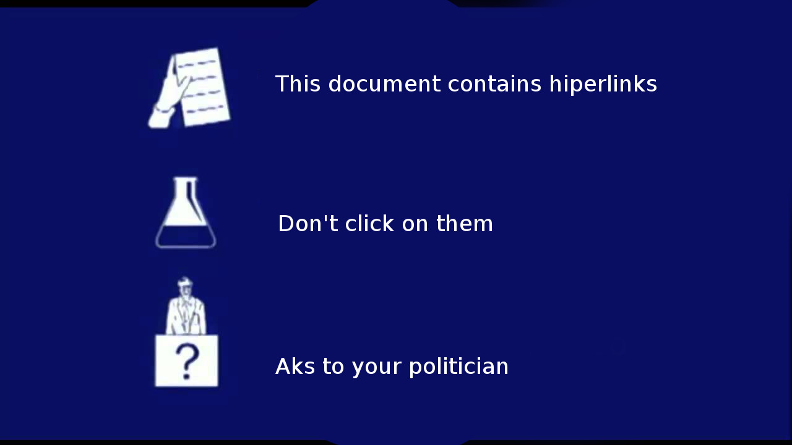
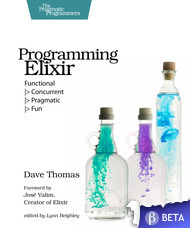
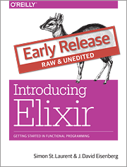
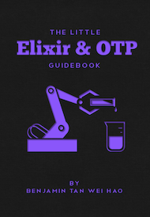

= Elixir
:slidebackground: big_logo
:title: Elixir
:description: Introduction to Elixir concepts
:keywords:  Elixir Erlang EVM BEAM Functional Programing Language
:Author:  José Luis Esteban
:Author Initials: JLEAHRED
:Date:   10/2014
:Email:   jleahred@gmail.com
:max-width!: 25em
:duration: 60
:incremental!:
:backend: slidy2

:resolution: 1920
//:resolution: 1024

ifdef::backend-slidy2[]
[small_logo,opacity: 0.3; position: absolute; right: 5%; bottom: 5%;]
&&&&
image:images/elixir_logo.png[]
&&&& 

[big_logo,opacity: 1.0; position: absolute; right: 30%; bottom: 20%;]
&&&&
image::images/elixir_big_logo.png[]
&&&&
endif::backend-slidy2[]

:slidebackground: small_logo

== Erlang/Elixir and  Me

    * C++ experience
    * Erlang and functional programing lover
    * Worked on financial realtime systems
    * Learner lover

<<<

* Responsable del desarrollo, diseño y mantenimento de un sistema distribuido de tiempo real para gestión de órdenes y precios de sistemas financieros electrónicos.
* Labor desempeñada durante más de 10 años.
* Entre otras, las tecnologías utilizadas han sido... C++, Tibco/rendezvous, AMQP/Qpid, Python, DSLs externos
* Desarrollo de librería en C++ reactiva, enfocada en tiempo real, multiplataforma, la seguridad y pocas dependencias.
* Puntuación C++ IKM (93/100)
* Apasionado por aprender, ciclismo, ciencia y tecnologías.

//image::images/me.png[]

== Introduction > Disclaimer
(las autoridades culturales informan)

== Why to look?

Books

[cols=2, frame="none", grid="none", align="center"]
|==================
a|

a|
image::images/book2.jpg[width=400]

a|

a|

|==================

<<<

    * Good opinions from Joe Amstrong
    * Dave Thomas speaking great and writting a book
    * Runs on Erlang VM

== Introduction > Aims

    * Elixir basic concepts
    * Current situation of Elixir
    * Debate

== Introduction > General scheme

    * **Prog lang, one more?**
    * Elixir is Erlang
    * Elixir is not Erlang
    * Debate

include::languages/lang_one_more.adoc[]

== General scheme

    * Prog lang, one more?
    * **Elixir is Erlang**
    * Elixir is not Erlang
    * Debate

include::elixir_is_erlang/elixir_is_erlang.adoc[]

== General scheme

    * Prog lang, one more?
    * Elixir is Erlang
    * **Elixir is not Erlang**
    * Debate

include::elixir_is_not_erlang/elixir_is_not_erlang.adoc[]

include::methaprograming/methaprograming.adoc[]

== And more...

    * Protocols
    * Log
    * Structs
    * Agents
    * Task
    * scriptize
    * ...

== More code???

_

== Questions?

image::images/questions.jpg[align="center" width=700]

== _

