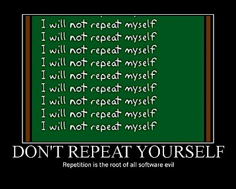
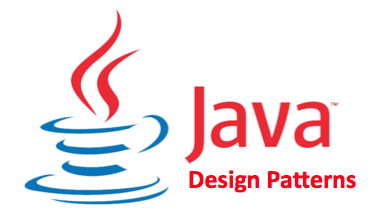
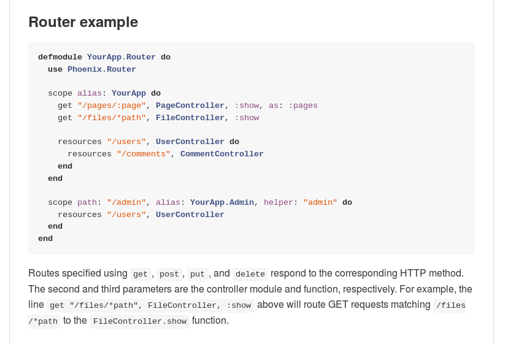
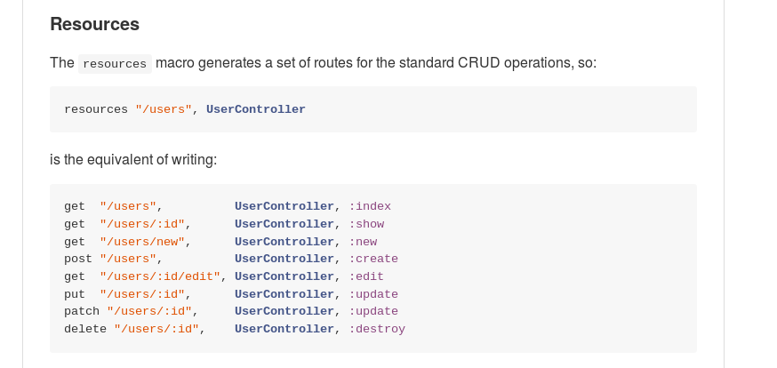
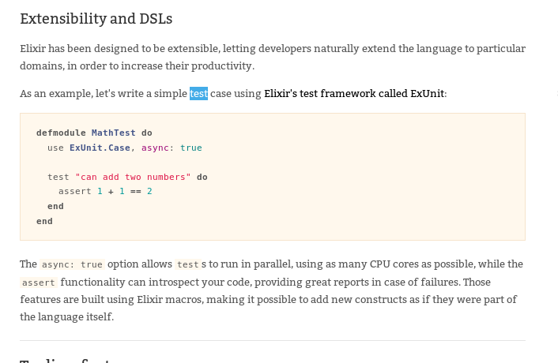

//:backend: slidy2
//:slidefontsizeadjust: 4

== Schema
[gray]#Elixir is NOT Erlang#

    * Syntax and basics
    * Tools
    * **Methaprogramming**

== Methaprogramming
[gray]#Elixir is NOT Erlang#

<<<
[gray]#Elixir is NOT Erlang#

[red big]#OR NOT#

== DRY
[gray]#Elixir is NOT Erlang > Methaprogramming#

== Design Patterns
[gray]#Elixir is NOT Erlang > Methaprogramming#

<<<
[gray]#Elixir is NOT Erlang > Methaprogramming#

Example, observer in Java

[source, java]
----------------
import java.util.Observable;
public class ObservableValue extends Observable
{
   private int n = 0;
   public ObservableValue(int n)
   {
      this.n = n;
   }
   public void setValue(int n)
   {
      this.n = n;
      setChanged();
      notifyObservers();
   }
   public int getValue()
   {
      return n;
   }
}
----------------

<<<
[gray]#Elixir is NOT Erlang > Methaprogramming#

[source, java]
----------------
import java.util.Observer;
import java.util.Observable;
public class TextObserver implements Observer
{
   private ObservableValue ov = null;
   public TextObserver(ObservableValue ov)
   {
      this.ov = ov;
   }
   public void update(Observable obs, Object obj)
   {
      if (obs == ov)
      {
         System.out.println(ov.getValue());
      }
   }
}
----------------

<<<
[gray]#Elixir is NOT Erlang > Methaprogramming#

[source, java]
----------------
public class Main
{
   public Main()
   {
      ObservableValue ov = new ObservableValue(0);
      TextObserver to = new TextObserver(ov);
      ov.addObserver(to);
   }
   public static void main(String [] args)
   {
      Main m = new Main();
   }
}
----------------

<<<
[gray]#Elixir is NOT Erlang > Methaprogramming#

Sometimes  

DRY + Design Patterns = Dont Rethink Yourself 

(just repeat)

== DONT REPEAT YOURSELF
[gray]#Elixir is NOT Erlang > Methaprogramming#

[big]#Is it possible?#

== DSL
[gray]#Elixir is NOT Erlang > Methaprogramming#

External

<<<
[gray]#Elixir is NOT Erlang > Methaprogramming#

sql

[source, sql]
------------------
SELECT *
 FROM  Book
 WHERE price > 100.00
 ORDER BY title;
------------------

<<<
[gray]#Elixir is NOT Erlang > Methaprogramming#

protobuff
------------------
message Person {
  required int32 id = 1;
  required string name = 2;
  optional string email = 3;
}
------------------

<<<
[gray]#Elixir is NOT Erlang > Methaprogramming#

peg
------------------
Expr    ← Sum
Sum     ← Product (('+' / '-') Product)*
Product ← Value (('*' / '/') Value)*
Value   ← [0-9]+ / '(' Expr ')'
------------------

<<<
[gray]#Elixir is NOT Erlang > Methaprogramming#

html, xml, sgml

[source, html]
------------------
<!DOCTYPE html>
<html>
<body>

<h1>Title</h1>

Hello world.

</body>
</html>
------------------

<<<
[gray]#Elixir is NOT Erlang > Methaprogramming#

json, yaml, ini, config

------------------
{"widget": {
    "debug": "on",
    "window": {
        "title": "Sample Konfabulator Widget",
        "name": "main_window",
        "width": 500,
        "height": 500
    },
    "image": { 
        "src": "Images/Sun.png",
        "name": "sun1",
        "hOffset": 250,
        "vOffset": 250,
        "alignment": "center"
    },
    "text": {
        "data": "Click Here",
        "size": 36,
        "style": "bold",
        "name": "text1",
        "hOffset": 250,
        "vOffset": 100,
        "alignment": "center",
        "onMouseUp": "sun1.opacity = (sun1.opacity / 100) * 90;"
    }
}} 
------------------

<<<
[gray]#Elixir is NOT Erlang > Methaprogramming#

makefile

[source, makefile]
---------------
all: hello

hello: main.o factorial.o hello.o
        g++ main.o factorial.o hello.o -o hello

main.o: main.cpp
        g++ -c main.cpp

factorial.o: factorial.cpp
        g++ -c factorial.cpp

hello.o: hello.cpp
        g++ -c hello.cpp

clean:
        rm -rf *o hello
---------------

<<<
[gray]#Elixir is NOT Erlang > Methaprogramming#

Internals

Ruby, Scala, Nermerle, Boo...

== Methaprogramming
[gray]#Elixir is NOT Erlang > Methaprogramming#

<<<
[gray]#Elixir is NOT Erlang > Methaprogramming#

[cols=2, frame="none", grid="none", align="center"]
|==================
a|

Dont Repeat Yourself

Keep It Simple Stupid

Extensibility

a|

|==================

<<<
[gray]#Elixir is NOT Erlang > Methaprogramming#

    * On execution
    * On compilation
    
<<<
[gray]#Elixir is NOT Erlang > Methaprogramming#

Elixir has execution and compilation Methaprogramming

== Elixir  Methaprogramming
[gray]#Elixir is NOT Erlang > Methaprogramming#

Let's go reality...

<<<
[gray]#Elixir is NOT Erlang > Methaprogramming#

Our first macro

== Go back to "if"
[gray]#Elixir is NOT Erlang > Methaprogramming#

<<<
[gray]#Elixir is NOT Erlang > Methaprogramming#

Wich one is sugar less?

[source, ruby]
------------
    if cond do
        IO.puts "cond"
    end
------------

[source, ruby]
------------
    if cond, do:  IO.puts "cond"
------------

== Reserved Keywords
[gray]#Elixir is NOT Erlang > Methaprogramming > IF#

COBOL  400

<<<
[gray]#Elixir is NOT Erlang > Methaprogramming > IF#

RUST  54

**************
as
box
break
continue 
crate
else 
enum 
extern
false 
fn 
for
if 
impl 
in
let 
loop
match 
mod 
mut
priv 
proc 
pub
ref 
return
self 
static 
struct 
super
true 
trait 
type
unsafe 
use
while
**************

<<<
[gray]#Elixir is NOT Erlang > Methaprogramming > IF#

JAVA  52

************
abstract
assert
boolean
break
byte
case
catch
char
class
const
continue
default
do
double
else
enum
extends
final
finally
float
for
goto
if
implements
import
instanceof
int
interface
long
native
new
package
private
protected
public
return
short
static
strictfp (as of J2SE 1.2)
super
switch
synchronized
this
throw
throws
transient
try
void
volatile
while
false
null
true
************

<<<
[gray]#Elixir is NOT Erlang > Methaprogramming > IF#

ERLANG  26

****************
after 
and 
andalso 
band 
begin 
bnot 
bor 
bsl 
bsr 
bxor 
case 
catch 
cond 
div 
end 
fun 
if 
let 
not 
of 
or 
orelse 
receive 
rem 
try 
when 
xor
**********

<<<
[gray]#Elixir is NOT Erlang > Methaprogramming > IF#

C  32

***************
auto
break
case
char
const
continue
default
do
double
else
enum
extern
float
for
goto
if
int
long
register
return
short
signed
sizeof
static
struct
switch
typedef
union
unsigned
void
volatile
while
*******************

<<<
[gray]#Elixir is NOT Erlang > Methaprogramming > IF#

C++  84

**************
alignas (since C++11)
alignof (since C++11)
and
and_eq
asm
auto(1)
bitand
bitor
bool
break
case
catch
char
char16_t (since C++11)
char32_t (since C++11)
class
compl
const
constexpr (since C++11)
const_cast
continue
decltype (since C++11)
default(1)
delete(1)
do
double
dynamic_cast
else
enum
explicit
export(1)
extern
false
float
for
friend
goto
if
inline
int
long
mutable
namespace
new
noexcept (since C++11)
not
not_eq
nullptr (since C++11)
operator
or
or_eq
private
protected
public
register
reinterpret_cast
return
short
signed
sizeof
static
static_assert (since C++11)
static_cast
struct
switch
template
this
thread_local (since C++11)
throw
true
try
typedef
typeid
typename
union
unsigned
using(1)
virtual
void
volatile
wchar_t
while
xor
xor_eq
***************************

<<<
[gray]#Elixir is NOT Erlang > Methaprogramming > IF#

GO  15

**********************
break        
default      
func         
interface    
select
case         
defer        
go           
map          
struct
chan         
else         
goto         
package      
switch
const        
fallthrough  
if           
range        
type
continue     
for          
import       
return       
var
*********************

<<<
[gray]#Elixir is NOT Erlang > Methaprogramming > IF#

RUBY  41

*******************
__LINE__ 
__FILE__ 
__ENCODING__
_BEGIN 
_END
_alias 
_and 
_begin
_break 
_case 
_class 
_def
_defined 
_do 
_else 
_elsif
_end 
_ensure 
_false
_for 
_in 
_module 
_next
_nil 
_not 
_or 
_redo
_rescue 
_retry 
_return 
_self
_super 
_then 
_true 
_undef
_when 
_yield 
_if 
_unless
_while 
_until
*****************

<<<
[gray]#Elixir is NOT Erlang > Methaprogramming > IF#

PYTHON  30

***************
and 
as 
assert 
break 
class 
continue 
def 
del 
elif 
else 
except 
exec 
finally 
for 
from 
global 
if 
import 
in 
is 
lambda 
not 
or 
pass 
print 
raise 
return 
try 
while 
with 
yield
**************

<<<
[gray]#Elixir is NOT Erlang > Methaprogramming > IF#

[horizontal]
COBOL:: 400
Rust:: 54
Java:: 52
Erlang:: 26
C::  32
C++:: 84
Go:: 15
Ruby:: 41
Python:: 30

<<<
[gray]#Elixir is NOT Erlang > Methaprogramming > IF#

[horizontal]
COBOL:: 400
Rust:: 54
Java:: 52
Erlang:: 26
C::  32
C++:: 84
Go:: 15
Ruby:: 41
Python:: 30

[big]#Elixir  8#

<<<
[gray]#Elixir is NOT Erlang > Methaprogramming > IF#

else

catch

after

rescue 

do

end

and

or

[red]#Where is my IF?#

== Go back to "if"
[gray]#Elixir is NOT Erlang > Methaprogramming#

<<<
[gray]#Elixir is NOT Erlang > Methaprogramming#

Wich one is sugar less?

[source, ruby]
------------
    if cond do
        IO.puts "cond"
    end
------------

[source, ruby]
------------
    if cond, do:  IO.puts "cond"
------------

<<<
[gray]#Elixir is NOT Erlang > Methaprogramming#

This has more sugar

[source, ruby]
------------
    if cond do
        IO.puts "cond"
    end
------------

This is sugar less

[source, ruby]
------------
    if cond, do:  IO.puts "cond"
------------

<<<
[gray]#Elixir is NOT Erlang > Methaprogramming#

Reducing sugar...

[source, ruby]
------------
    if cond, do:  IO.puts "cond"
------------

<<<
[gray]#Elixir is NOT Erlang > Methaprogramming#

Reducing sugar...

[source, ruby]
------------
    if cond, [do:  IO.puts "cond"]
------------

<<<
[gray]#Elixir is NOT Erlang > Methaprogramming#

Reducing sugar...

[source, ruby]
------------
    if cond, [{:do,  IO.puts "cond"}]
------------

<<<
[gray]#Elixir is NOT Erlang > Methaprogramming#

Reducing sugar...

[source, ruby]
------------
    if(cond, [{:do,  IO.puts "cond"}])
------------

It looks like a function and makes "cuak"

but... at compile time

== Compilation diagram
[gray]#Elixir is NOT Erlang > Methaprogramming#

[jle_temp_and_run]
++++++++++++++++++++++++
run=[('dot -O -Tpng /tmp/adoc/compilation1.dot', '', 'wt')]

file_name='compilation1.dot'

digraph G 
{ 
    rankdir=TB; 
    node[fontsize=18 width=3 style="filled,rounded" fillcolor="#ddeeffff" shape=rectangle] "elixir.SRC"  "elixir.AST"
    node[width=3 style="filled,rounded" fillcolor="#ffddddff" shape=rectangle] "erlang.AST"  "erlang.BEAM"

    "elixir.SRC" -> "elixir.AST" -> "erlang.AST" -> "erlang.BEAM"
}

++++++++++++++++++++++++

image::/tmp/adoc/compilation1.dot.png[align="center", width=400]

<<<
[gray]#Elixir is NOT Erlang > Methaprogramming#

[jle_temp_and_run]
++++++++++++++++++++++++
run=[('dot -O -Tpng /tmp/adoc/compilation2.dot', '', 'wt')]

file_name='compilation2.dot'

digraph G 
{ 
    rankdir=TB; 
    node[fontsize=18 width=3 style="filled,rounded" fillcolor="#ddeeffff" shape=rectangle] "elixir.SRC"  "elixir.AST"
    node[width=3 style="filled,rounded" fillcolor="#ffddddff" shape=rectangle] "erlang.AST"  "erlang.BEAM"

    "elixir.SRC" -> "elixir.AST" [label="sugar reduction"]
    "elixir.AST" -> "erlang.AST" -> "erlang.BEAM"
}

++++++++++++++++++++++++

image::/tmp/adoc/compilation2.dot.png[align="center", width=400]

<<<
[gray]#Elixir is NOT Erlang > Methaprogramming#

[jle_temp_and_run]
++++++++++++++++++++++++
run=[('dot -O -Tpng /tmp/adoc/compilation3.dot', '', 'wt')]

file_name='compilation3.dot'

digraph G 
{ 
    rankdir=TB; 
    node[fontsize=18 width=3 style="filled,rounded" fillcolor="#ddeeffff" shape=rectangle] "elixir.SRC"
    node[width=3 style="filled,rounded" fillcolor="#ffddddff" shape=rectangle] "erlang.AST"  "erlang.BEAM"
    node[fontsize=18 width=3 style="filled,rounded" fillcolor="#9999ffff" shape=rectangle] "elixir.code-exec"
    node[label="elixir.AST" fontsize=18 width=3 style="filled,rounded" fillcolor="#ddeeffff" shape=rectangle] "elixir.AST"

    "elixir.SRC" -> "elixir.AST" [label="sugar reduction"]
    "elixir.AST" -> "elixir.code-exec"
    "elixir.code-exec" ->  "erlang.AST" -> "erlang.BEAM"
}

++++++++++++++++++++++++

image::/tmp/adoc/compilation3.dot.png[align="center", width=400]

<<<
[gray]#Elixir is NOT Erlang > Methaprogramming#

[jle_temp_and_run]
++++++++++++++++++++++++
run=[('dot -O -Tpng /tmp/adoc/compilation4.dot', '', 'wt')]

file_name='compilation4.dot'

digraph G 
{ 
    rankdir=TB; 
    node[fontsize=18 width=3 style="filled,rounded" fillcolor="#ddeeffff" shape=rectangle] "elixir.SRC"
    node[width=3 style="filled,rounded" fillcolor="#ffddddff" shape=rectangle] "erlang.AST"  "erlang.BEAM"
    node[fontsize=18 width=3 style="filled,rounded" fillcolor="#9999ffff" shape=rectangle] "elixir.code-exec"
    node[label="elixir.AST" fontsize=18 width=3 style="filled,rounded" fillcolor="#ddeeffff" shape=rectangle] "elixir.AST"

    "elixir.SRC" -> "elixir.AST" [label="sugar reduction"]
    "elixir.AST" -> "elixir.code-exec" ->  "elixir.AST"
    "elixir.code-exec" ->  "erlang.AST" -> "erlang.BEAM"
}

++++++++++++++++++++++++

image::/tmp/adoc/compilation4.dot.png[align="center", width=400]

== Reserved keywords test
[gray]#Elixir is NOT Erlang > Methaprogramming#

Ok. Then [big red]#if# is not a reserved keyword

<<<
[gray]#Elixir is NOT Erlang > Methaprogramming#

is [big red]#def# a reserved keyword?

[cols=2, frame="none", grid="none", align="center"]
|==================
a|

[source, ruby]
-------------------
    def  double(n)  do
        n*2
    end
-------------------

a|

|==================

<<<
[gray]#Elixir is NOT Erlang > Methaprogramming#

is [big red]#def# a reserved keyword?

[cols=2, frame="none", grid="none", align="center"]
|==================
a|

[source, ruby]
-------------------
    def  double(n)  do
        n*2
    end
-------------------

a|

|==================

<<<
[gray]#Elixir is NOT Erlang > Methaprogramming#

is [big red]#defmodule# a reserved keyword?

[cols=2, frame="none", grid="none", align="center"]
|==================
a|

[source, ruby]
-------------------
defmodule  MyModule  do

    def  double(n)  do
        n*2
    end
    
end
-------------------

a|

|==================

<<<
[gray]#Elixir is NOT Erlang > Methaprogramming#

is [big red]#defmodule# a reserved keyword?

[cols=2, frame="none", grid="none", align="center"]
|==================
a|

[source, ruby]
-------------------
defmodule  MyModule  do

    def  double(n)  do
        n*2
    end
    
end
-------------------

a|

|==================

<<<
[gray]#Elixir is NOT Erlang > Methaprogramming#

is [big red]#defmacro# a reserved keyword?

[cols=2, frame="none", grid="none", align="center"]
|==================
a|

[source, ruby]
-------------------
defmodule  MyModule  do

    defmacro  my_macro do
        ...
    endo

    def  double(n)  do
        n*2
    end
    
end
-------------------

a|

|==================

<<<
[gray]#Elixir is NOT Erlang > Methaprogramming#

is [big red]#defmacro# a reserved keyword?

[cols=2, frame="none", grid="none", align="center"]
|==================
a|

[source, ruby]
-------------------
defmodule  MyModule  do

    defmacro  my_macro do
        ...
    endo

    def  double(n)  do
        n*2
    end
    
end
-------------------

a|

|==================

== Elixir reserved keywords
[gray]#Elixir is NOT Erlang > Methaprogramming#

They are not language constructor

They are syntax sugar...

----------------------
do
end
else
catch
after
rescue 
and
or
----------------------

== Running code...
[gray]#Elixir is NOT Erlang > Methaprogramming#

Remember, your code is executed during compilation

[cols=2, frame="none", grid="none", align="center"]
|==================
a|

Your code will generate a BEAM
a|

image::/tmp/adoc/compilation4.dot.png[align="center", width=400]

|==================

<<<
[gray]#Elixir is NOT Erlang > Methaprogramming#

Are you sure? Show me some code.

== Removing sugar... or generating Elixir AST
[gray]#Elixir is NOT Erlang > Methaprogramming#

[source, ruby]
-------------
quote do
    IO.puts x+2
end
-------------

== Let's write a macro
[gray]#Elixir is NOT Erlang > Methaprogramming#

[source, ruby]
-------------
defmodule  SillyMacro  do

  defmacro  generate_function  do
    quote do
      def double(n) do
        n * 2
      end
    end
  end

end

defmodule  Silly  do
  IO.puts "Generating function..."

  require SillyMacro
  SillyMacro.generate_function()
end
-------------

<<<
[gray]#Elixir is NOT Erlang > Methaprogramming#

[source, ruby]
-------------
defmodule  SillyMacro  do

  defmacro  generate_function(function_name) do
    quote do
      def unquote(function_name)(n) do
        n * 2
      end
    end
  end

end

defmodule  Silly  do
  IO.puts "Generating function..."

  require SillyMacro
  SillyMacro.generate_function(:double3)
end
-------------

<<<
[gray]#Elixir is NOT Erlang > Methaprogramming#

[source, ruby]
-------------
defmodule  SillyMacro  do

  defmacro  generate_function(function_name) do
    atom_fn = String.to_atom(function_name)
    quote do
      def unquote(atom_fn)(n) do
        n * 2
      end
    end
  end

end

defmodule  Silly  do
  IO.puts "Generating function..."

  require SillyMacro
  SillyMacro.generate_function("double4")
end
-------------

<<<
[gray]#Elixir is NOT Erlang > Methaprogramming#

[source, ruby]
-------------
defmodule  SillyMacro  do

  defmacro  generate_function do
    IO.puts "Write function name"
    fn_atom = IO.read(:line)
        |> String.strip
        |> String.to_atom

    IO.puts "Generating function... #{inspect fn_atom}"
    quote do
      def unquote(fn_atom)(n) do
        n * 2
      end
    end
  end

end

defmodule  Silly  do

  require SillyMacro

  SillyMacro.generate_function
end
-------------

<<<
[gray]#Elixir is NOT Erlang > Methaprogramming#

[source, ruby]
-------------
defmodule  SillyMacro  do

  defmacro  generate_double_fn(fname) do
    quote do
      def unquote(fname  |>  String.to_atom)(n)  do
        2*n
      end
    end
  end

end

defmodule  Silly  do
  require SillyMacro
  SillyMacro.generate_double_fn("pr1")   # OK

  pr2 = "pr2"
  SillyMacro.generate_double_fn(pr2)     # WRONG
end

----------------

<<<
[gray]#Elixir is NOT Erlang > Methaprogramming#

[source, ruby]
-------------
defmodule  SillyMacro  do

  defmacro  generate_double_fn(fname) do
    quote bind_quoted: [fname: fname] do
      def unquote(fname  |>  String.to_atom)(n)  do
        2*n
      end
    end
  end

end

defmodule  Silly  do
  require SillyMacro
  SillyMacro.generate_double_fn("pr1")

  pr2 = "pr2"
  SillyMacro.generate_double_fn(pr2)
end
----------------

<<<
[gray]#Elixir is NOT Erlang > Methaprogramming#

[source, ruby]
-------------
defmodule  SillyMacro  do

  defmacro  generate_double_fn(fname) do
    quote bind_quoted: [fname: fname] do
      IO.puts "Generating function... #{fname}"
      f_atom_name = fname
                      |> String.strip
                      |> String.to_atom
      def unquote(f_atom_name)(n)  do
        2*n
      end
    end
  end

end

defmodule  Silly  do
  require SillyMacro

  IO.puts "Write de function name..."
  SillyMacro.generate_double_fn(IO.read :line)
end
------------

== Macro Higiene
[gray]#Elixir is NOT Erlang > Methaprogramming#

This is not...

[source, cpp]
---------------------
#define is_minor(a, b)  ++a<=b

void  test(void)
{
    int a=10;
    
    if(is_minor(a, 20))
        std::cout << "minor than 20" << std::endl;
}
---------------------

== Even more interesting examples > erlang
[gray]#Elixir is NOT Erlang > Methaprogramming#

[source, erlang]
------------------
-module(ch3).
-behaviour(gen_server).

-export([start_link/0]).
-export([alloc/0, free/1]).
-export([init/1, handle_call/3, handle_cast/2]).

start_link() ->
    gen_server:start_link({local, ch3}, ch3, [], []).

alloc() ->
    gen_server:call(ch3, alloc).

free(Ch) ->
    gen_server:cast(ch3, {free, Ch}).

init(_Args) ->
    {ok, channels()}.

handle_call(alloc, _From, Chs) ->
    {Ch, Chs2} = alloc(Chs),
    {reply, Ch, Chs2}.

handle_cast({free, Ch}, Chs) ->
    Chs2 = free(Ch, Chs),
    {noreply, Chs2}.
------------------

== Even more interesting examples > elixir
[gray]#Elixir is NOT Erlang > Methaprogramming#

[source, python]
------------
defmodule KV.Registry do
  use GenServer

  ## Client API

  @doc """
  Starts the registry.
  """
  def start_link(opts \\ []) do
    GenServer.start_link(__MODULE__, :ok, opts)
  end

  @doc """
  Looks up the bucket pid for `name` stored in `server`.

  Returns `{:ok, pid}` if the bucket exists, `:error` otherwise.
  """
  def lookup(server, name) do
    GenServer.call(server, {:lookup, name})
  end

  @doc """
  Ensures there is a bucket associated to the given `name` in `server`.
  """
  def create(server, name) do
    GenServer.cast(server, {:create, name})
  end

  ## Server Callbacks

  def init(:ok) do
    {:ok, HashDict.new}
  end

  def handle_call({:lookup, name}, _from, names) do
    {:reply, HashDict.fetch(names, name), names}
  end

  def handle_cast({:create, name}, names) do
    if HashDict.get(names, name) do
      {:noreply, names}
    else
      {:ok, bucket} = KV.Bucket.start_link()
      {:noreply, HashDict.put(names, name, bucket)}
    end
  end
end
------------

== Examples > elixir > macros
[gray]#Elixir is NOT Erlang > Methaprogramming#

[source, ruby]
---------------------
defmodule LoginManager  do
  use ExActor.GenServer

    definit  do
        :random.seed(:erlang.now)
        initial_state(:w_rq_key)
    end

    defcall  rq_key,      state: :w_rq_key            do
        key = to_string(:random.uniform 100000)
        set_and_reply({:w_rq_login, key}, {:key, key})
    end

    defcall  (rq_login   user_name, codded_pass),    state: {:w_rq_login, key}   do
        if login_rq_info_ok { user_name, key, codded_pass }   do
            set_and_reply(:login_ok,  :login_ok)
        else
            set_and_reply(:rq_key,    :login_rejected)
        end
    end

end
---------------------

== Examples > elixir > phoenix
[gray]#Elixir is NOT Erlang > Methaprogramming#

<<<
[gray]#Elixir is NOT Erlang > Methaprogramming#

== Examples > elixir > testing
[gray]#Elixir is NOT Erlang > Methaprogramming#

<<<
[gray]#Elixir is NOT Erlang > Methaprogramming#

[source, ruby]
-----------------
defmodule Weather do
  use Ecto.Model

  schema "weather" do
    field :city     # Defaults to type :string
    field :temp_lo, :integer
    field :temp_hi, :integer
    field :prcp,    :float, default: 0.0
  end
end

defmodule Simple do
  import Ecto.Query

  def sample_query do
    query = from w in Weather,
          where: w.prcp > 0 or w.prcp == nil,
         select: w
    Repo.all(query)
  end
-----------------

== Sigils

[source, ruby]
--------------------
# A regular expression that returns true if the text has foo or bar
iex> regex = ~r/foo|bar/
~r/foo|bar/
iex> "foo" =~ regex
true
iex> "bat" =~ regex
false
--------------------

== Conclusions
[gray]#Elixir is NOT Erlang > Methaprogramming#

[cols=2, frame="none", grid="none", align="center"]
|==================
a|

    * DRY
    * KISS
    * Clear code
    * Extensebility
    * internal DSL

a|

    
|==================
